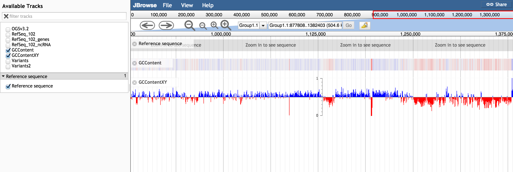

# gccontent

A JBrowse plugin for plotting GCContent. Plugin consists of a storeClass that
automatically calculates the percentage of G/C bases in a region, a track
type that derives from the Wiggle XY or density types, and a dialog box to
adjust the sliding window size

## Example configuration

    {
      "storeClass" : "JBrowse/Store/SeqFeature/IndexedFasta",
      "type": "GCContent/View/Track/GCContentXY",
      "label": "GCContent",
      "urlTemplate" : "Amel_4.5_scaffolds.fa",
      "bicolor_pivot": 0.5
    }

## Options

General options:

* storeClass: tested with JBrowse/Store/SeqFeature/IndexedFasta and JBrowse/Store/SeqFeature/SequenceChunks (i.e. output of prepare-refseqs.pl)
* windowSize: Size of sliding window (default 100)
* windowDelta: Step size of the sliding window (default 10)
* type: GCContent/View/Track/GCContentXY (XYPlot) or GCContent/View/Track/GCContent (density)

Other default params

* bicolor_pivot: 0.5
* max_score: 1
* min_score: 0

See http://gmod.org/wiki/JBrowse_Configuration_Guide#Wiggle.2FBigWig_Tracks_.28XYPlot.2C_Density.29 for more options
