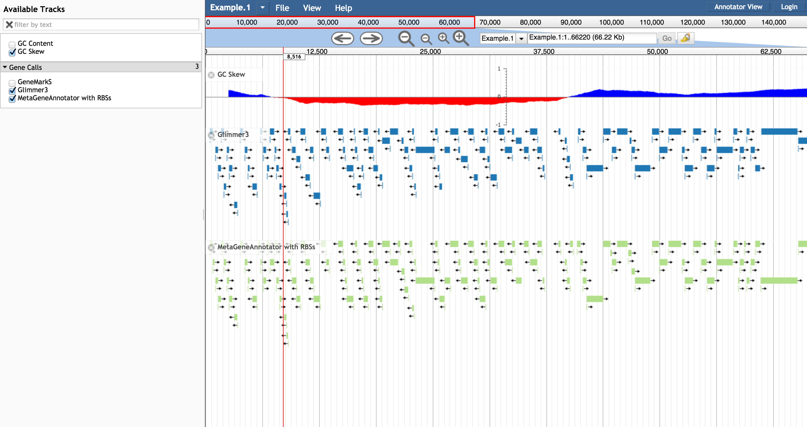

# gccontent

[](https://travis-ci.org/elsiklab/gccontent)

A JBrowse plugin for plotting GC Content and GC Skew. The plugin consists of a storeClass that
automatically calculates the percentage of G/C bases in a region, a track
type that derives from the Wiggle XY or density types, and a dialog box to
adjust the sliding window size, window step size, and the calculation mode (content or skew)


Fig 1. GC content




Fig 2. GC skew (note change in orientation of gene predictions)

## Example configuration

Using default SequenceChunks store

    {
      "storeClass" : "JBrowse/Store/SeqFeature/SequenceChunks",
      "type": "GCContent/View/Track/GCContentXY",
      "label" : "GCContentXY",
      "urlTemplate" : "seq/{refseq_dirpath}/{refseq}-",
      "bicolor_pivot": 0.5
    }


Using GC skew (and indexed FASTA)

    {
      "storeClass" : "JBrowse/Store/SeqFeature/IndexedFasta",
      "type": "GCContent/View/Track/GCContentXY",
      "label": "GC Skew",
      "urlTemplate" : "Amel_4.5_scaffolds.fa",
      "gcMode": "skew",
      "min_score": -1,
      "bicolor_pivot": 0
    }


Note: if you use SequenceChunks for the store class, then make the regular sequence track (i.e. not the GCContent one) have "label": "refseqs"

    {
       "key" : "Reference sequence",
       "storeClass" : "JBrowse/Store/Sequence/StaticChunked",
       "chunkSize" : 20000,
       "urlTemplate" : "seq/{refseq_dirpath}/{refseq}-",
       "label" : "refseqs",
       "type" : "SequenceTrack"
    }

Otherwise jbrowse tries to use the GCContent track as the store class for getting reference sequences


## Example config for twobit

```
{
   "formatVersion" : 1,
   "tracks" : [
      {
         "storeClass" : "JBrowse/Store/SeqFeature/TwoBit",
         "type": "GCContent/View/Track/GCContentXY",
         "label" : "GCContentXY",
         "urlTemplate" : "seq/volvox.2bit",
         "bicolor_pivot": 0.5
      },
      {
         "category" : "Reference sequence",
         "key" : "Reference sequence",
         "label" : "DNA",
         "seqType" : "dna",
         "storeClass" : "JBrowse/Store/Sequence/TwoBit",
         "type" : "SequenceTrack",
         "urlTemplate" : "seq/volvox.2bit",
         "useAsRefSeqStore" : 1
      }
   ]
}
```

The twobit was loaded via bin/prepare-refseqs.pl --twobit volvox.2bit

## Example config for bgzip FASTA

For BGZip fasta, available after JBrowse 1.15.4

```
{
   "formatVersion" : 1,
   "refSeqs" : "seq/volvox.fa.gz.fai",
   "tracks" : [
      {
        "storeClass" : "JBrowse/Store/SeqFeature/BgzipIndexedFasta",
        "type": "GCContent/View/Track/GCContentXY",
        "label": "GC Content",
        "urlTemplate" : "seq/volvox.fa.gz"
      },
      {
         "category" : "Reference sequence",
         "faiUrlTemplate" : "seq/volvox.fa.gz.fai",
         "gziUrlTemplate" : "seq/volvox.fa.gz.gzi",
         "key" : "Reference sequence",
         "label" : "DNA",
         "seqType" : "dna",
         "storeClass" : "JBrowse/Store/SeqFeature/BgzipIndexedFasta",
         "type" : "SequenceTrack",
         "urlTemplate" : "seq/volvox.fa.gz",
         "useAsRefSeqStore" : 1
      }
   ]
}
```

The bgzip fasta was loaded via bin/prepare-refseqs.pl --bgzip_fasta volvox.fa.gz where you have already performed bgzip -i and faidx indexing

```
bgzip -i volvox.fa
samtools faidx volvox.fa.gz
```

Resulting in three files

```
volvox.fa.gz
volvox.fa.gz.fai
volvox.fa.gz.gzi
```

## Options

General options:

* storeClass: tested with JBrowse/Store/SeqFeature/IndexedFasta, JBrowse/Store/SeqFeature/BgzipIndexedFasta, JBrowse/Store/SeqFeature/TwoBit, JBrowse/Store/SeqFeature/SequenceChunks (i.e. output of prepare-refseqs.pl)
* windowSize: Size of sliding window (default 100)
* windowDelta: Step size of the sliding window (default 10)
* gcMode: The calculation mode, either "skew" for calculation gc skew or "content" for gc content (default: content)
* type: GCContent/View/Track/GCContentXY (XYPlot) or GCContent/View/Track/GCContent (density)
* maxZoom: The maximum level for which to calculate the GC content for. Measured in pixels per basepair. Default: 0.0001. Make smaller fraction to allow zooming out more

Other default params

* bicolor_pivot: 0.5
* max_score: 1
* min_score: 0

See http://gmod.org/wiki/JBrowse_Configuration_Guide#Wiggle.2FBigWig_Tracks_.28XYPlot.2C_Density.29 for more options


## Intallation

Clone the repository to the jbrowse plugins subdirectory and name it GCContent

    git clone https://github.com/cmdcolin/gccontent GCContent

Then add the plugin to your configuration, e.g. "plugins": ["GCContent"]

See http://gmod.org/wiki/JBrowse_FAQ#How_do_I_install_a_plugin for details
